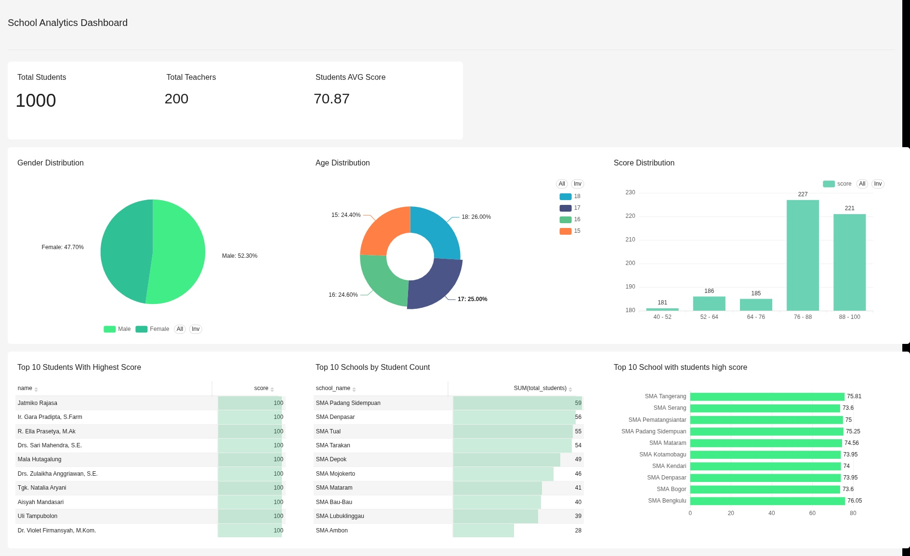

# 📊 School Data Pipeline & Analytics (MySQL → ClickHouse → Superset)

## 🚀 Overview

This project is an end-to-end **data pipeline and analytics system** that simulates a real-world data engineering workflow.

It covers:

* Fake data generation (schools, teachers, students)
* Data quality issue simulation
* ETL pipeline (MySQL → ClickHouse)
* Analytical data warehouse design
* Interactive dashboard using Apache Superset

This project demonstrates practical skills required for **Data Engineer, Data Analyst, and BI Engineer roles**.

---

## 🏗️ Architecture

```text
Fake Data Generator (Python)
        ↓
MySQL (OLTP / Raw Data)
        ↓
ETL Pipeline (Python)
        ↓
ClickHouse (OLAP / Analytics)
        ↓
Superset Dashboard (BI)
```

---

## 📁 Project Structure

```text
school-data-pipeline
│
├── data/
│   ├── raw/
│   └── clean/
│
├── scripts/
│   ├── generate_data.py
│   ├── load_data.py
│   ├── simulate_problem.py
│   ├── etl_pipeline.py
│
├── docker/
│   └── docker-compose.yml
│
├── dashboard/
│   └── dashboard.jpg
│
└── README.md
```

---

## ⚙️ Tech Stack

* **Python** (Pandas, Faker)
* **MySQL** (OLTP database)
* **ClickHouse** (OLAP database)
* **Apache Superset** (Business Intelligence dashboard)
* **Docker & Docker Compose**

---

## 🧪 Dataset

Generated dataset includes:

* **Schools** (50 records)
* **Teachers** (~200 records)
* **Students** (~1000 records)


---

## ⚠️ Data Quality Simulation

The project intentionally introduces real-world data issues:

* Duplicate records
* Missing values
* Invalid age values
* Invalid foreign keys (school_id)

---

## 🔄 ETL Pipeline

### Extract

Data is extracted from MySQL using SQLAlchemy.

### Transform

* Remove duplicates
* Handle missing values
* Filter invalid records

### Load

Data is loaded into ClickHouse using `clickhouse_connect`.

---

## 🗄️ Data Warehouse (ClickHouse)

Uses **MergeTree engine** for high-performance analytics.

### Example Schema

```sql
CREATE TABLE school_db.students (
    student_id String,
    name String,
    gender String,
    age UInt8,
    school_id String,
    score UInt8,
    created_at DateTime
)
ENGINE = MergeTree()
ORDER BY (school_id, student_id);
```

---

## 📊 Dashboard (Superset)


---

## 📈 Key Insights

### 1. Balanced Gender Distribution

The dataset shows a relatively balanced gender distribution:

* Male: 52.3%
* Female: 47.7%

This indicates no significant gender bias and ensures reliable comparative analysis across genders.

---

### 2. Strong Academic Performance

* Average score: **70.87**
* Majority of students fall within the **76–100 score range**

This suggests overall strong academic performance across schools. However, the concentration of high scores may indicate potential **grade inflation**.

---

### 3. High Score Concentration

Most students are clustered in higher score ranges (76–100).

This implies:

* A positively skewed distribution (not normal)
* Potentially high-performing schools or lenient grading standards

---

### 4. Realistic Age Distribution

Student ages (15–18) are evenly distributed:

* 15: 24.4%
* 16: 24.6%
* 17: 25.0%
* 18: 26.0%

This reflects a realistic high school population with no significant anomalies.

---

### 5. School Size ≠ Performance

The school with the highest number of students is not the top-performing school.

This indicates:

* Larger schools do not necessarily produce better outcomes
* Performance depends on other factors (teaching quality, student selection, etc.)

---

### 6. Top Performing Schools

Some schools (e.g., **SMA Tangerang**) consistently show higher average scores (~75+).

This suggests:

* Better academic environments
* More effective teaching or student quality

---

### 7. High-Performing Student Cluster

Top 10 students all achieved perfect scores (**100**).

This may indicate:

* A cluster of high-achieving students
* Potential concentration of top talent in specific schools

---

### 8. Minimal Performance Gap Between Schools

Average scores across schools are relatively close (around 70–76).

This suggests:

* Fairly even distribution of academic quality
* No extreme outliers in school performance

---

### 9. Ideal Teacher-to-Student Ratio

* Total students: 1000
* Total teachers: 200
* Ratio: **1 : 5**

This is significantly better than real-world averages (typically 1:20–30), indicating:

* Highly supportive learning conditions
* Or synthetic data that is more “ideal” than realistic

---

### 10. Overall System Observation

The dataset reflects a **stable and balanced educational system**:

* No extreme outliers
* Consistent performance across schools
* Even demographic distribution

However, it also shows signs of:

* Optimistic data conditions
* Limited variability compared to real-world scenarios

---

## ▶️ How to Run

### 1. Start Services

```bash
docker compose up -d
```

---

### 2. Generate Data

```bash
python scripts/generate_data.py
```

---

### 3. Simulate Data Issues

```bash
python scripts/simulate_problem.py
```

---

### 4. Load data to MySQL

```bash
python scripts/load_data.py
```

---
### 5. Run ETL Pipeline

```bash
python scripts/etl_pipeline.py
```

---

### 6. Access Superset

```
http://localhost:8088
```

---

## 🔥 Future Improvements

* Incremental ETL pipeline
* Airflow orchestration
* Data validation (Great Expectations)
* Materialized views in ClickHouse
* Real-time streaming pipeline

---

## 👨‍💻 Author

This project is built as a portfolio project to demonstrate:

* Data pipeline design
* Data modeling
* SQL & analytics
* Data cleaning
* Dashboard development

---

## ⭐ Highlights

This project showcases:

* End-to-end data workflow
* OLTP → OLAP pipeline design
* Realistic data issues handling
* Analytical dashboarding
* Production-like architecture

---
